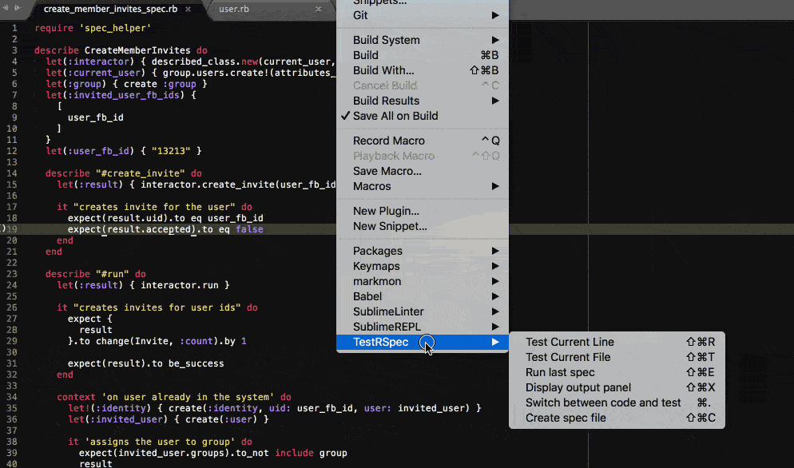

# Sublime RSpec

RSpec plugin for Sublime Text 3

Run, navigate and create specs from Sublime editor.



## Motivation

I have used [RubyTest](https://github.com/maltize/sublime-text-2-ruby-tests)
plugin for some time and was not happy with it.

So I decided to create a simple to understand and develop plugin targeting only `rspec`.

## Installation

With [Package Control](http://wbond.net/sublime_packages/package_control):

1. Run “Package Control: Install Package” command, find and install `Test Rspec` plugin.
2. Restart SublimeText editor

Manually:

1. Clone this git repository into your packages folder (in SublimeText, Preferences -> Browse Packages to open this folder)
2. Restart SublimeText editor

## Output

Executed using sublime build tools `exec` command.

When preconditions are not satisfied outputs to panel.

## Configuration

[Read this](http://www.granneman.com/webdev/editors/sublime-text/configuring-sublime-text/)
if you want to know how Sublime package settings work.

Find settings in "Preferences -> Package Settings -> TestRSpec"

[Default settings](https://github.com/astrauka/TestRSpec/blob/master/TestRSpec.sublime-settings)

## Key bindings

Find bindings in "Preferences -> Package Settings -> TestRSpec"

[Default bindings](https://github.com/astrauka/TestRSpec/blob/master/Default.sublime-keymap)

## Features

### Run rspec

Executes Sublime command to run rspec.
Displays output in panel.

Launch rspec for:
* current line
* current file
* run previous spec

Command generation

```
# output example
# /home/user/.rbenv/bin/rbenv exec bundle exec spring rspec /home/user/dev/project/spec/models/user_spec.rb:2
#
# ProjectRoot
#   project root by ../spec
#
# SpecTarget
#   file + line
#
# Rspec
#   Environment variables
#     take from configuration
#
#   (BinRspec || RubyRspec) + SpecTarget
#
#   BinRspec
#     find /bin/rspec from project root
#
#   on ./bin/rspec not found
#     RubyRspec : (Rbenv || Rvm || SystemRuby) + Bundle + Spring
#       Rbenv on configuration
#         find $HOME/.rbenv/bin/rbenv exec
#
#       Bundle on configuration
#         check if Gemfile is present
#         bundle exec
#
#       Spring on configuration
#         check if Gemfile contains spring
#         spring
```

### Switch between code and test

Returns all matches by file name.

Prioritizes matches by path as they are more likely the right ones
such that in most cases you pick the first match.

### Create spec file

Creates spec file when launched in source file.

Uses code snippet defined in settings.

## TODO

- [ ] release package

## Acknowledgments

Inspired by https://github.com/maltize/sublime-text-2-ruby-tests

Parts that are taken:
* test console theme
* key bindings
* idea of how to switch between code and test
* idea of how to run spec

## Contribution

Help is always welcome. Create an issue is you need help.

### Sublime Text plugin development links

* [Create plugin](https://clarknikdelpowell.com/blog/creating-sublime-text-3-plugins-part-1/)
* [Submit package](https://packagecontrol.io/docs/submitting_a_package)
* [Forum](https://forum.sublimetext.com/c/technical-support)
* [Documentation](https://www.sublimetext.com/docs/3/)
* [Api reference](https://www.sublimetext.com/docs/3/api_reference.html)
* [Auto reloading](https://forum.sublimetext.com/t/auto-reloading-of-python-module-files-used-by-plugin/5321/7)
* [Extract package](https://github.com/SublimeText/ExtractSublimePackage) -
`view.execute_command("extract_single_package_file", "Default")` to extract default package and understand plugin development basics
* [Package settings](https://www.sublimetext.com/docs/3/packages.html)
* [Unofficial documentation](http://docs.sublimetext.info/en/latest/index.html)

## Changelog

### v1.0.0

* Initial release

## Copyright and license

Copyright © 2016 [@astrauka](http://twitter.com/astrauka)

Licensed under the [**MIT**](http://miro.mit-license.org) license.
